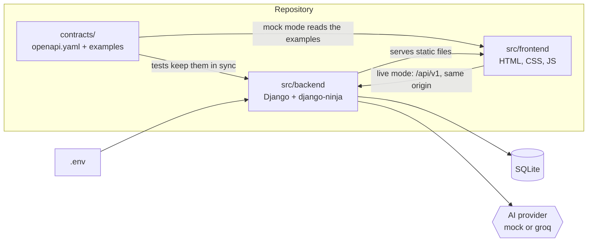
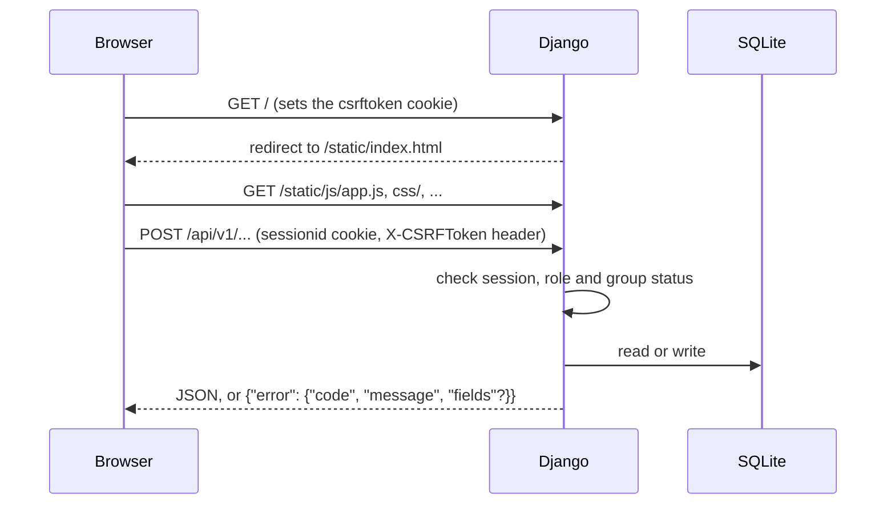
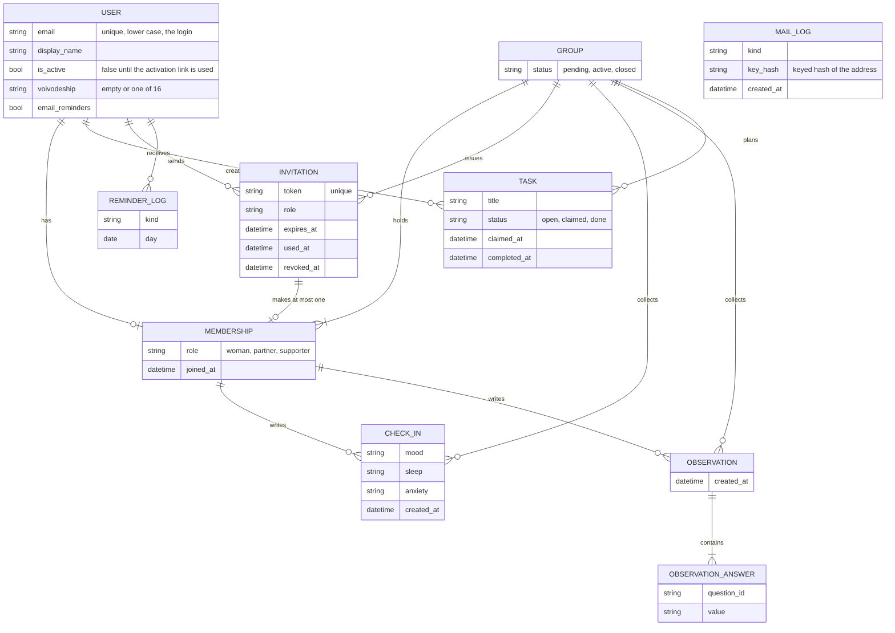
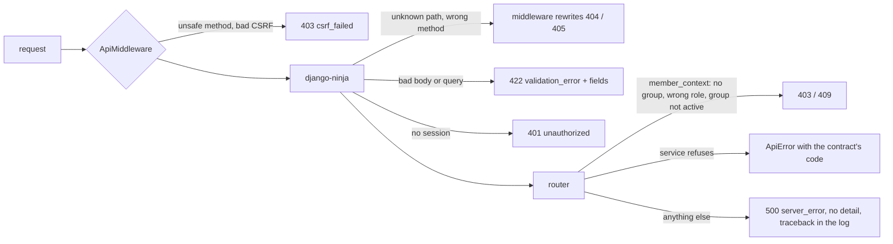
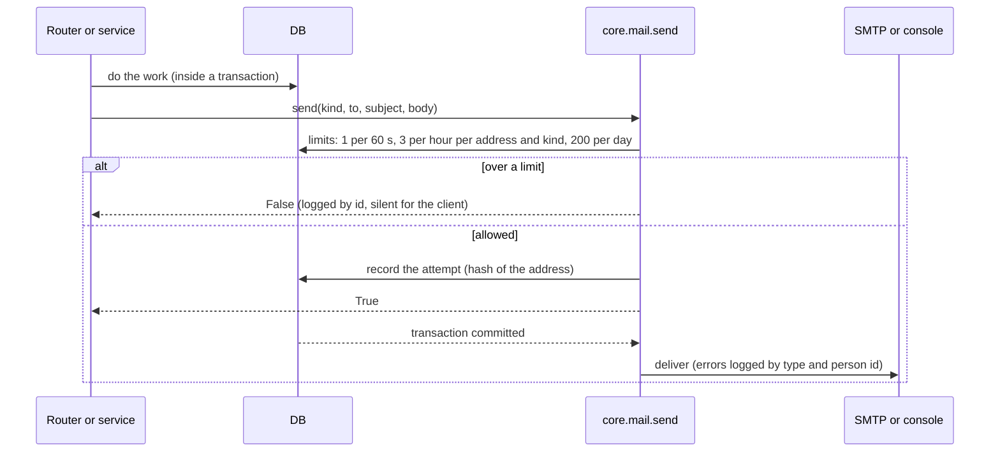
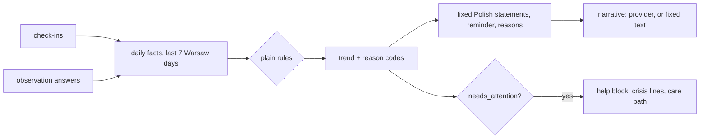
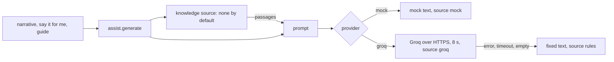

# Architecture

Short on purpose. The API itself is described in [contracts/openapi.yaml](../contracts/openapi.yaml);
this page shows how the parts fit and what is planned.

## Components

- The contract is written by hand and is the only place where backend and frontend meet.
- One origin: Django serves the frontend and the API, so the session cookie works and CORS is not
  needed.
- No build step on the frontend. Polish strings live in `src/frontend/js/strings.pl.js`.

## Request flow

In mock mode the browser reads `contracts/examples/<operationId>.<status>.json` instead and sends
nothing to `/api/v1`.

## Data model

One initial migration holds the whole schema. The application checks every rule first; the database
has the last word (unique and check constraints), so a path that bypasses the application cannot
break an invariant.

| Rule | Where the database enforces it |
|---|---|
| A person is in one group | unique `membership.user` |
| One woman per group | unique `membership.group` where `role = 'woman'` |
| An invitation makes one membership | unique `membership.invitation` |
| An invitation is not both used and revoked | check constraint |
| One answer per question and observation | unique `(observation, question_id)` |
| A task is never `claimed` without a claimer, `open` with one, or `done` without a completion time | check constraint on `status`, `claimed_by`, `completed_at` |
| One e-mail reminder per person, kind and day | unique `(user, kind, day)` |
| E-mail addresses are unique in any letter case | unique on `lower(email)` |
| Check-in and answer values, roles, statuses come from fixed sets | check constraints |

A person belongs to one group. The role is on the membership, not on the account. Check-ins and
observations point at the membership of their author. Observation answers are stored per author,
but no operation ever returns one answer or its author; only the trend engine (plain, explainable
rules) reads them. Stored times are UTC; "today" and "the last 7 days" are Europe/Warsaw calendar
days, and `core/clock.py` is the only place that knows the time, so tests can freeze it.

## Errors

Every error under `/api/v1` has the shape `{"error": {"code", "message", "fields"?}}`, also the ones
Django would answer itself.

Routers call `core.permissions.member_context(request, roles, active=...)` first and hold no other
rule; services raise `ApiError`. Messages are Polish and live next to the check that raises them;
the messages for schema checks are in `core/errors.py`.

## E-mail

All e-mail goes through `core/mail.py`. A request never fails or answers differently because of mail.

`EMAIL_MODE=console` (default) prints messages; `smtp` sends them through `EMAIL_HOST`. Links in
messages start with `APP_BASE_URL`. A rolled back request sends nothing and counts nothing.

## Roles and permissions

`x` means allowed. Every group operation also needs a membership (otherwise 403 `not_a_member`),
and the operations marked with `*` need an active group (otherwise 409 `group_pending`, or `group_closed` after she closed it).

| Operation | woman | partner | supporter | Notes |
|---|---|---|---|---|
| health, register, login | anyone | anyone | anyone | no session needed |
| logout, get_me, get_group, create_group, accept_invitation | x | x | x | any signed-in person, in a group or not; get_group answers 404 without a group; a supporter cannot create a group |
| get_invitation | anyone | anyone | anyone | the token is the secret |
| list_members, get_summary, list_tasks | x | x | x | summary wording depends on the role |
| create_invitation | x | x | | the woman invites a partner or a supporter; a partner invites only the woman, and only while the group is pending |
| close_group, remove_member | x | | | only the woman |
| create_check_in\*, list_check_ins | x | | | private to the woman |
| list_self_care | x | | | |
| list_observation_questions, create_observation\* | | x | x | closed questions, no free text |
| create_task\*, claim_task\*, complete_task\* | x | x | x | only the person who claimed a task completes it |

Privacy rules the contract enforces: her check-ins are readable only by her; the summary holds
general statements and a trend label, never a single answer and never its author.

## Trend and summary

The rules are in `core/services/trend.py` (a pure function over per-day booleans, no author id).
`needs_attention` when she has 3 signal days, observations have 3, both have 2, or a check-in of
today or yesterday has very low mood and strong anxiety. `stable` needs data on 3 days and at most
one signal day. Otherwise `uncertain`. Statements depend only on the trend and on the reader's
role, never on which source fired, so one observer cannot be singled out. The narrative prompt gets
the trend and the general statements only.

## AI seam

A provider is a class with `generate(prompt) -> Generation(text, source)` in `core/ai/`; it raises
only `ProviderError`. `assist.generate(feature, prompt, fallback)` is the one entry point: it
turns every failure into the fixed fallback with source `rules`, and lists the passages of the
knowledge source in `sources` (empty until retrieval exists, so adding it changes no response
shape). "Say it for me" checks fixed crisis phrases before any provider is called; a match returns
`crisis: true` with the help block and no generated text.

| `AI_PROVIDER` | Behaviour |
|---|---|
| `mock` (default) | Offline and deterministic, labelled `mock`. |
| `groq` | Needs `GROQ_API_KEY`; the key never appears in logs or responses. |

Any other value, or `groq` without a key, stops startup with a message that names the problem.

## Operations added after v0

`contracts/README.md` lists the 19 operations added after v0. Their roles:

| Operation | woman | partner | supporter | Notes |
|---|---|---|---|---|
| signup, activate_account, resend_activation, request_password_reset, confirm_password_reset | anyone | anyone | anyone | identical answers for known and unknown addresses |
| change_password, delete_account, get_preferences, update_preferences, get_help | x | x | x | any signed-in person |
| leave_group | | x | x | the woman closes the group first (409 while active); after closing she may leave and the group is deleted |
| list_invitations, revoke_invitation | x | x | | the partner only while the group is pending |
| get_summary_extended, list_task_suggestions, release_task, list_reminders | x | x | x | |
| ai_say_it_for_me | x | | | |
| ai_conversation_guide | | x | x | |
