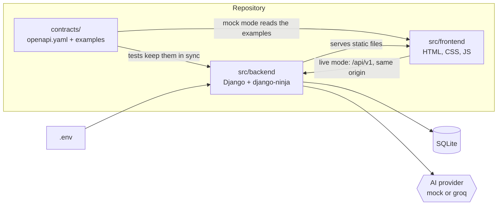
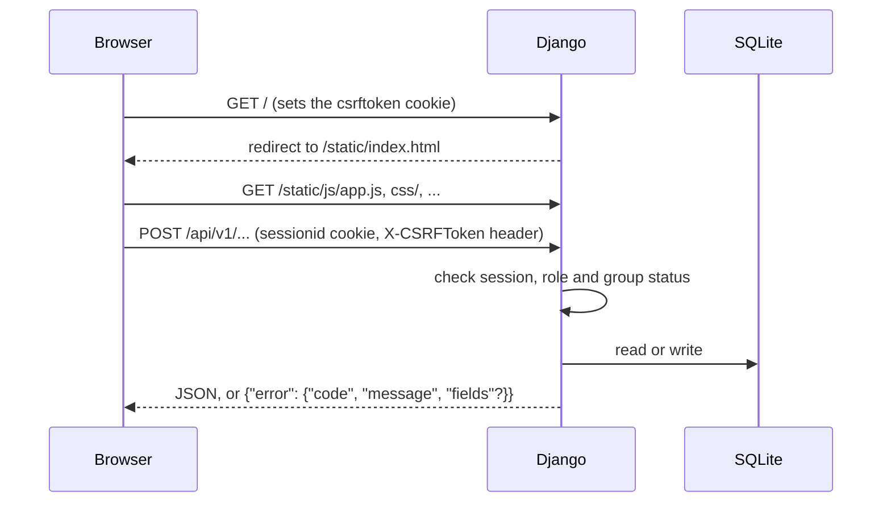
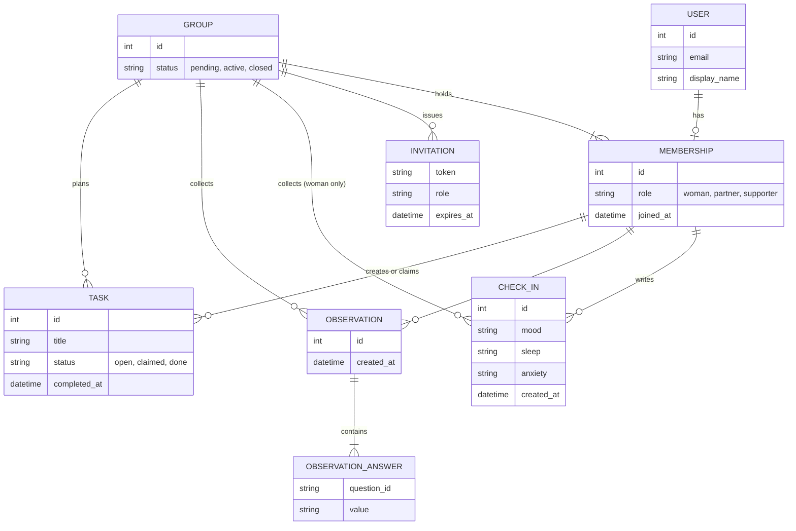

# Architecture

Short on purpose. The API itself is described in [contracts/openapi.yaml](../contracts/openapi.yaml);
this page shows how the parts fit and what is planned.

## Components

- The contract is written by hand and is the only place where backend and frontend meet.
- One origin: Django serves the frontend and the API, so the session cookie works and CORS is not
  needed.
- No build step on the frontend. Polish strings live in `src/frontend/js/strings.pl.js`.

## Request flow

In mock mode the browser reads `contracts/examples/<operationId>.<status>.json` instead and sends
nothing to `/api/v1`.

## Planned data model

Nothing of this exists yet; the next changes add it.

A person belongs to one group. The role is on the membership, not on the account. Observation
answers are stored per author, but no operation ever returns one answer or its author; only the
trend engine (plain, explainable rules) reads them.

## Roles and permissions

`x` means allowed. Every group operation also needs a membership (otherwise 403 `not_a_member`),
and the operations marked with `*` need an active group (otherwise 409 `group_pending`).

| Operation | woman | partner | supporter | Notes |
|---|---|---|---|---|
| health, register, login | anyone | anyone | anyone | no session needed |
| logout, get_me, get_group, create_group, accept_invitation | x | x | x | any signed-in person, in a group or not; get_group answers 404 without a group; a supporter cannot create a group |
| get_invitation | anyone | anyone | anyone | the token is the secret |
| list_members, get_summary, list_tasks | x | x | x | summary wording depends on the role |
| create_invitation | x | x | | the woman invites a partner or a supporter; a partner invites only the woman, and only while the group is pending |
| close_group, remove_member | x | | | only the woman |
| create_check_in\*, list_check_ins | x | | | private to the woman |
| list_self_care | x | | | |
| list_observation_questions, create_observation\* | | x | x | closed questions, no free text |
| create_task\*, claim_task\*, complete_task\* | x | x | x | only the person who claimed a task completes it |

Privacy rules the contract enforces: her check-ins are readable only by her; the summary holds
general statements and a trend label, never a single answer and never its author.

## AI provider

Generated texts (the summary narrative) come from a provider chosen by `AI_PROVIDER` in `.env`.

| Value | Behaviour |
|---|---|
| `mock` (default) | Offline and deterministic: the same input gives the same text. Its output carries `source: "mock"`, so mock text is never shown as real model output. |
| `groq` | Not available yet; the adapter arrives in a later change. Its key will live in `.env` as `GROQ_API_KEY`. |

A provider is a class with `generate(prompt) -> Generation(text, source)` in `src/backend/core/ai/`.
Any other value stops startup with a message that lists the available values; the check runs when
the `core` app starts. The values of `source` are listed in the contract (summary `narrative`).
