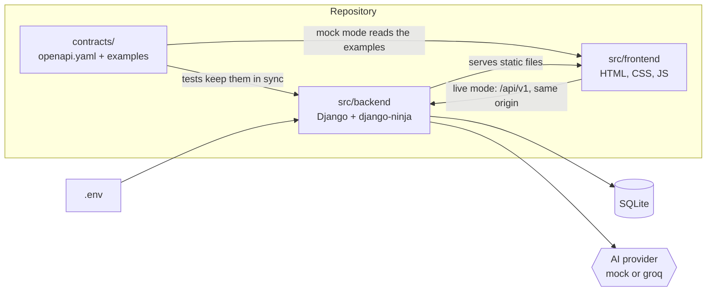
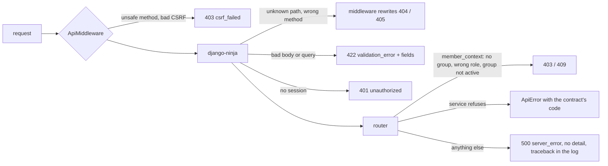
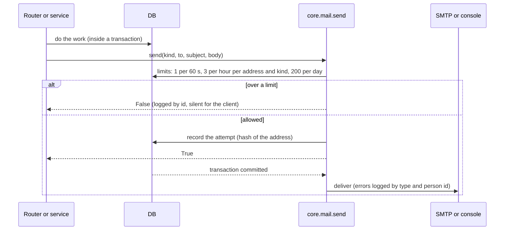
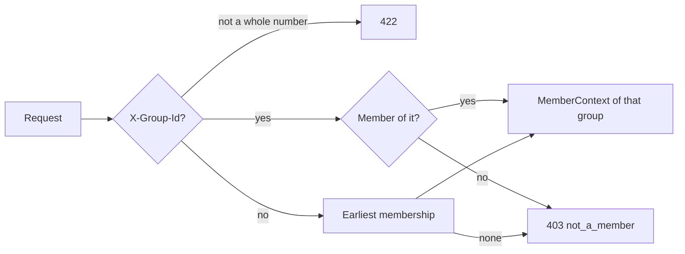
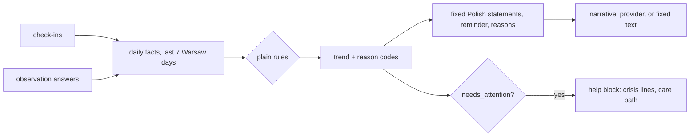
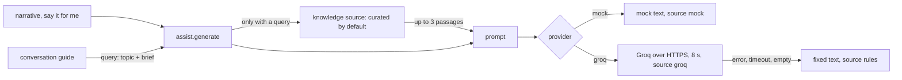

# Architecture

Short on purpose. The API itself is described in [contracts/openapi.yaml](../contracts/openapi.yaml);
this page shows how the parts fit and what is planned.

## Components



- The contract is written by hand and is the only place where backend and frontend meet.
- One origin: Django serves the frontend and the API, so the session cookie works and CORS is not
  needed.
- No build step on the frontend. Polish strings live in `src/frontend/js/strings.pl.js`.

## Request flow

```mermaid
sequenceDiagram
    participant Browser
    participant Django
    participant DB as SQLite
    Browser->>Django: GET / (the page itself; sets the csrftoken cookie)
    Django-->>Browser: index.html
    Browser->>Django: GET /js/app.js, /css/, /fonts/, ... (also under /static/)
    Browser->>Django: POST /api/v1/... (sessionid cookie, X-CSRFToken header)
    Django->>Django: check session, role and group status
    Django->>DB: read or write
    Django-->>Browser: JSON, or {"error": {"code", "message", "fields"?}}
```

In mock mode the browser reads `contracts/examples/<operationId>.<status>.json` instead and sends
nothing to `/api/v1`.

## Data model

The initial migration holds the schema; `0002_many_memberships` lets a person belong to many groups. The application checks every rule first; the database
has the last word (unique and check constraints), so a path that bypasses the application cannot
break an invariant.


| Rule | Where the database enforces it |
|---|---|
| A person is in a group at most once | unique `(membership.user, membership.group)` |
| A person is the woman of at most one group | unique `membership.user` where `role = 'woman'` |
| One woman per group | unique `membership.group` where `role = 'woman'` |
| An invitation makes one membership | unique `membership.invitation` |
| An invitation is not both used and revoked | check constraint |
| One answer per question and observation | unique `(observation, question_id)` |
| A task is never `claimed` without a claimer, `open` with one, or `done` without a completion time | check constraint on `status`, `claimed_by`, `completed_at` |
| One e-mail reminder per person, kind and day | unique `(user, kind, day)` |
| E-mail addresses are unique in any letter case | unique on `lower(email)` |
| Check-in and answer values, roles, statuses come from fixed sets | check constraints |

A person can belong to many groups: the woman of one group (at most) and the partner or supporter
of any number of others. The role is on the membership, not on the account. A partner waits in at
most one pending group at a time; that rule lives in the service, because it spans the group table.
Going back from migration 0002 fails loudly while a person has more than one membership. Check-ins and
observations point at the membership of their author. Observation answers are stored per author,
but no operation ever returns one answer or its author; only the trend engine (plain, explainable
rules) reads them. Stored times are UTC; "today" and "the last 7 days" are Europe/Warsaw calendar
days, and `core/clock.py` is the only place that knows the time, so tests can freeze it.

## Errors

Every error under `/api/v1` has the shape `{"error": {"code", "message", "fields"?}}`, also the ones
Django would answer itself.



Routers call `core.permissions.member_context(request, roles, active=...)` first and hold no other
rule; services raise `ApiError`. Messages are Polish and live next to the check that raises them;
the messages for schema checks are in `core/errors.py`.

## E-mail

All e-mail goes through `core/mail.py`. A request never fails or answers differently because of mail.



`EMAIL_MODE=console` (default) prints messages; `smtp` sends them through `EMAIL_HOST`. Links in
messages start with `APP_BASE_URL`. A rolled back request sends nothing and counts nothing.

## Selected group

Every group-bound request names its group in the optional header `X-Group-Id`. `member_context` is
the only place that resolves it, so each router gets the behaviour without edits.



`get_me` and `get_group` read the same header. `list_memberships` and the other account-level
operations ignore it. The frontend session reads `get_me`, then `list_memberships`, keeps the
selected group in `localStorage`, drops it when the person is no longer a member, and sends the
header on every call that is not account-level (`ACCOUNT_LEVEL` in `js/api.js`).

## Roles and permissions

`x` means allowed. Every group operation also needs a membership (otherwise 403 `not_a_member`),
and the operations marked with `*` need an active group (otherwise 409 `group_pending`, or `group_closed` after she closed it).

| Operation | woman | partner | supporter | Notes |
|---|---|---|---|---|
| health, register, login | anyone | anyone | anyone | no session needed |
| logout, get_me, get_group, create_group, accept_invitation, list_memberships | x | x | x | any signed-in person, in a group or not; get_group answers 404 without a group; a supporter cannot create a group; a person who is the woman of a group cannot create or accept a second one as the woman |
| get_invitation | anyone | anyone | anyone | the token is the secret |
| list_members, get_summary, list_tasks | x | x | x | summary wording depends on the role |
| create_invitation | x | x | | the woman invites a partner or a supporter; a partner invites only the woman, and only while the group is pending |
| close_group, remove_member | x | | | only the woman |
| create_check_in\*, list_check_ins | x | | | private to the woman |
| list_self_care | x | | | |
| list_observation_questions, create_observation\* | | x | x | closed questions, no free text |
| create_task\*, claim_task\*, complete_task\* | x | x | x | only the person who claimed a task completes it |

Privacy rules the contract enforces: her check-ins are readable only by her; the summary holds
general statements and a trend label, never a single answer and never its author.

## Trend and summary



The rules are in `core/services/trend.py` (a pure function over per-day booleans, no author id).
`needs_attention` when she has 3 signal days, observations have 3, both have 2, or a check-in of
today or yesterday has very low mood and strong anxiety. `stable` needs data on 3 days and at most
one signal day. Otherwise `uncertain`. Statements depend only on the trend and on the reader's
role, never on which source fired, so one observer cannot be singled out. The narrative prompt gets
the trend and the general statements only.

## AI seam



A provider is a class with `generate(prompt) -> Generation(text, source)` in `core/ai/`; it raises
only `ProviderError`. `assist.generate(feature, prompt, fallback, query=None)` is the one entry
point: it turns every failure into the fixed fallback with source `rules`. Only a feature that
passes a `query` gets passages: today that is the conversation guide. "Say it for me" and the
summary narrative pass none, so her words never become a search and a personal message has no
citations. "Say it for me" checks fixed crisis phrases before any provider is called; a match
returns `crisis: true` with the help block and no generated text.

| `AI_PROVIDER` | Behaviour |
|---|---|
| `mock` (default) | Offline and deterministic, labelled `mock`. |
| `groq` | Needs `GROQ_API_KEY`; `GROQ_MODEL` defaults to `qwen/qwen3.8-27b`; the key never appears in logs or responses; a `<think>` block in an answer is dropped. |

Any other value, or `groq` without a key, stops startup with a message that names the problem.

### Knowledge source (light retrieval)

| `KNOWLEDGE_SOURCE` | Behaviour |
|---|---|
| `curated` (default) | Reviewed passages in `core/content/knowledge.json`. |
| `none` | No passages, `sources` stays empty. |

Each passage in the file has an id, the title and link of a public Polish page, a short summary in
our own words (at most 400 characters), guide topics and keyword stems. A lookup folds the query
(lowercase, no Polish diacritics). Passages are ranked by topic hits (a topic tag in the query),
then keyword hits (a keyword that starts a word), then file order. The best three from different
pages are used. The guide asks with `"<topic> <brief>"`. The passages go into the prompt as background,
and their titles and links come back in `sources`. When the fixed lines are used (no model answer,
or no usable line), the guide cites nothing.

Generated guide lines that show the speaker's gender ("myślałem", "żebym pomógł", "będę
pomagał", "jestem dumny") are dropped, because the reader may be anyone. Without a key, the mock
provider gives the helpers sample texts that fit their screens, labelled `mock`. An embedding search can replace the curated source later behind
the same `retrieve(query)` method.

## Operations added after v0

`contracts/README.md` lists the 20 operations added after v0. Their roles:

| Operation | woman | partner | supporter | Notes |
|---|---|---|---|---|
| signup, activate_account, resend_activation, request_password_reset, confirm_password_reset | anyone | anyone | anyone | identical answers for known and unknown addresses |
| change_password, delete_account, get_preferences, update_preferences, get_help | x | x | x | any signed-in person |
| leave_group | | x | x | the woman closes the group first (409 while active); after closing she may leave and the group is deleted |
| list_invitations, revoke_invitation | x | x | | the partner only while the group is pending |
| get_summary_extended, list_task_suggestions, release_task, list_reminders | x | x | x | |
| ai_say_it_for_me | x | | | |
| ai_conversation_guide | | x | x | |
