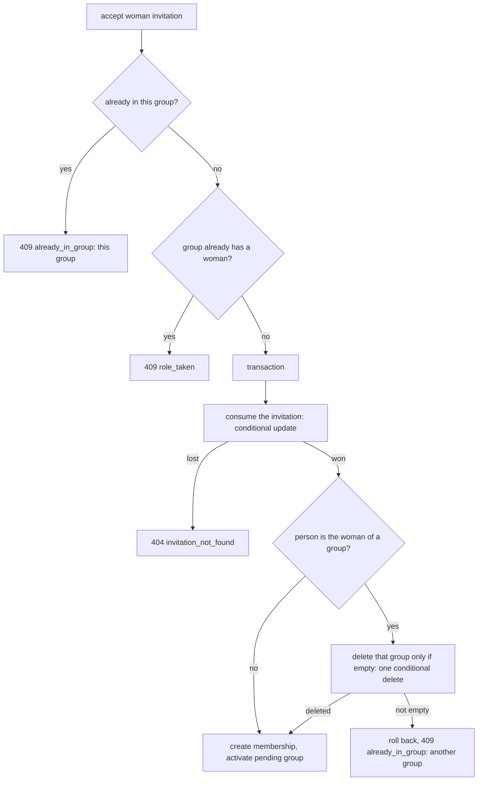
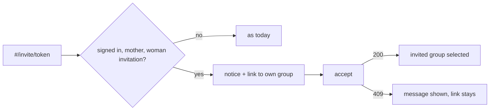

## Context

`invitations.accept` refuses a `woman` invitation with `already_in_group` whenever the person already has a membership as the woman (`_already_blocked`), whatever that group holds. The same code and the text "Należysz już do grupy." cover "already in *this* group" too. The rule itself (one mother per person, enforced by a unique constraint) stays. The invitation screen (`screens/invite.js`) shows the accept button to everyone and only shows the error text afterwards. The mother can already close her group and, once it is closed, delete it with `leave_group`.

## Goals / Non-Goals

**Goals:** a mother with an empty group can take a mother invitation without a detour; a mother with a real group is told why and what to do; nothing with content is ever deleted by accepting.
**Non-goals:** new fields or operations in the contract, merging groups, a second mother group, replacing on `create_group`.

## Decisions

### 1. Replace inside `accept`, atomically

Order inside the transaction matters twice. The invitation is consumed first, as today, so two accepts still queue and exactly one wins. The old group is deleted *before* the new membership is created, because the unique constraint allows one woman membership per person.

Alternative: check emptiness first, outside the transaction, and delete later. Rejected: a task added in between would be deleted with the group.

### 2. Emptiness is decided by the delete itself
`cleanup.delete_empty_group(group_id, user_id)` runs one `DELETE` on `Group` with filters: the group has exactly one membership and it is that user's, and no row in `CheckIn`, `Task` or `Observation` points to it. The number of deleted rows says what happened: 1 means replaced, 0 means refuse. There is no read-then-write gap, no reliance on SQLite's single-writer lock, and it works on any database (rule "atomic conditional UPDATE instead of read-modify-write"). Memberships, invitations and the rest cascade as for any group delete. Alternative: count the rows first and delete after. Rejected as above.

### 3. Two messages, one code
`already_in_group` stays, so the frozen error shape and the frontend's handling do not change. Messages (drafts, Polish):
- same group: "Należysz już do tej grupy."
- woman elsewhere, with content: "Jesteś już mamą w innej grupie, w której są dane albo inne osoby. Zamknij ją i usuń na jej ekranie, a potem przyjmij zaproszenie jeszcze raz."
- `create_group` as the woman while already a woman: "Jesteś już mamą jednej grupy."

Examples: `accept_invitation.409.json` becomes the "same group" answer, `accept_invitation.409.mother.json` is new. The contract tests that compare examples with real answers get both. Alternative: new code `mother_elsewhere`. Rejected: it changes the contract for a text problem, and older clients would not know the code.

### 4. The invitation screen explains before the click
The session already holds the person's memberships (`list_memberships`), so the screen knows whether they are a mother (role `woman`) and which group is theirs. For a `woman` invitation it adds a notice above the accept button and a link "Przejdź do swojej grupy" (selects the mother's group and opens `#/group`). The notice cannot say whether the group is empty, because the memberships carry no such field, so it says both outcomes. After a refused accept the server's message is shown under it as today.

Alternative: add `empty: bool` to `list_memberships` so the screen can be exact. Rejected for now: a contract change, an example change and a mock change for a sentence; revisit if the two-outcome notice confuses people.

### 5. Mock mode mirrors the backend
The mock store's `accept_invitation` applies the same rule on its in-memory data: a mother with a group that has no other member, task or check-in has it replaced; otherwise it answers the new 409 example. This keeps the browser demo honest.

## Risks / Trade-offs

- Deleting a group is irreversible. Mitigation: only a group with no data and no other member, decided in one statement; the screen warns first; the deleted group's unused invitation links die (said in the assumptions).
- A person may open the invitation, see the notice, and not understand "empty". Mitigation: wording reviewed; the link to the group screen lets them look.
- The real-case mother had already closed her group. A closed empty group is replaceable, so she would have gone through; closing was never needed.
- No data migration. No schema change.
