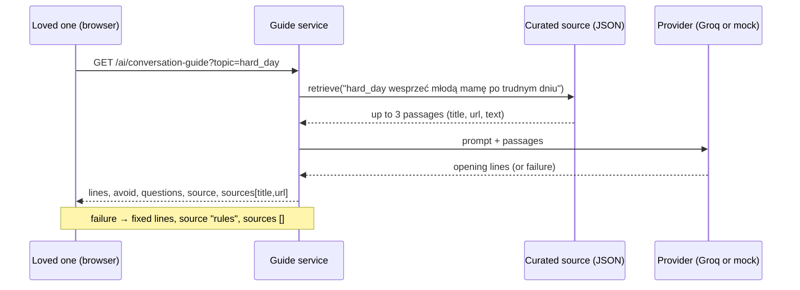
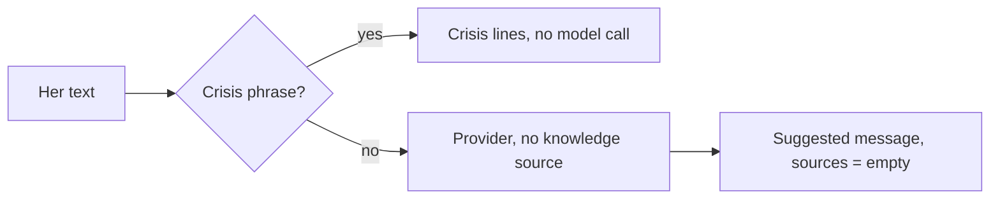

# Design

## Context

See proposal.md for the motivation. Current state:

- `core/ai/assist.generate(feature, prompt, fallback)` is the single entry point for generated text. It asks `get_knowledge().retrieve(prompt)` on every call, adds the passages to the prompt, and returns `Result(text, source, sources)`. The only knowledge source is `NullKnowledge` (`KNOWLEDGE_SOURCE=none`).
- The guide (`services/assist_guide.py`) generates only the opening lines. "Avoid" and "questions" are fixed lists per topic (`content/guide_topics.py`). The response schemas allow only `title` and `url` for a source, with `additionalProperties: false`, and the contract must not change.
- `GroqProvider` sends `GROQ_MODEL` (default `llama-3.3-70b-versatile`, now retired) with an 8 s timeout and reads `choices[0].message.content`.
- The frontend has no AI screen. `api.js` fills path parameters but has no query string support. On phones the navigation is a bottom bar with up to six items.
- Tests run with `tests.settings`, which never reads `.env`, so a local `AI_PROVIDER=groq` cannot leak into tests.

## Goals / Non-Goals

**Goals:**
- Retrieval that is easy to read, deterministic and offline, and that a later embedding search can replace behind the same `KnowledgeSource.retrieve(query)` interface.
- Her own words never leave the "say it for me" path: no retrieval, no storage, no browser storage.
- AI text honestly labelled, sources clickable.

**Non-Goals:**
- Ranking quality beyond "roughly right for five topics". Passages are chosen by hand for the topics.
- Showing passage text in the UI (the contract has no field for it).

## Decisions

### 1. Retrieval: topic tags plus keyword stems over a JSON file

Each passage in `core/content/knowledge.json` has `id`, `title`, `url`, `text`, `topics` (guide topic ids) and `keywords` (folded stems such as `lekarz`, `pomoc`, `sluch`). The query is folded with the same `fold` as the crisis list (lowercase, no Polish diacritics, single spaces) and split into words.

- Score: +3 for each passage topic that equals a query word, +1 for each keyword that starts a query word (prefix match covers Polish word forms).
- Keep passages with a score of 1 or more, sort by score (highest first) and then by file order, and return the first three.

The guide's query is `"<topic id> <topic brief>"`, so the topic tag decides first and the keywords break ties.

Alternatives:
- **Embeddings** need a model, a dependency and a vector store. That is too much for a demo of five topics.
- **A database table** needs a migration and an admin screen, and nobody edits passages at runtime.
- **Fetching pages live** is slow, fragile and can break the 8 s budget.

### 2. Retrieval only when a feature asks for it

`generate(feature, prompt, fallback, query=None)` asks the knowledge source only when `query` is given. Only the guide passes one. The other option was to retrieve for every prompt, as today, and filter later. That would turn her private text into a search query and would put medical passages into the narrative and into her personal message.

### 3. Passage content and the site name

Passages are short summaries in plain Polish, written from public pages that were opened and read, with the page title and link. No long quotes. The UI shows the title as the link text and derives the site name from the link's host (`pacjent.gov.pl`). The contract stays unchanged. Adding a `publisher` field would change a schema, which the contract rule forbids.

### 4. Default knowledge source is `curated`

The file is part of the product, works offline, and is deterministic. With it as the default, the deployment needs no extra variable. `none` stays available to switch citations off. Two existing tests change on purpose: the default setting, and the guide test that expected empty sources by default.

### 5. Model: `qwen/qwen3.8-27b`, think blocks removed

On 2026-10-04 the key listed `openai/gpt-oss-120b`, `openai/gpt-oss-20b`, `qwen/qwen3.8-27b` and non-chat models. In a short test with the real prompts:

- `qwen/qwen3.8-27b` wrote the most natural Polish in 0.2–0.5 s.
- `gpt-oss-120b` was stiffer and spends tokens on reasoning.

Some Qwen models can put a `<think>…</think>` block in the content, so the provider removes such a block before checking for an empty answer. It is a safety net; the test call showed none. `GROQ_MODEL` remains the switch.

### 6. Prompts and grammatical gender

Both models sometimes wrote "chciałbym" or "zastanawiałam się" although the guide prompt asked for no gender. The guide prompt now says it plainly: no first-person past tense or conditional forms that show gender, with examples. A test call after the change still gave "chciałbym" in 2 of 6 guides.

So the guide also drops every generated line that holds such a form, using a regular expression for the endings `-łem`, `-łam`, `-łbym`, `-łabym` and `-łobym`. A false match (for example "stołem") costs one line, not the answer. When no line is left, the fixed lines are used. They are labelled `rules` and cite nothing, because no passage shaped them. Before this change the code returned the passages with the fixed lines.

The "say it for me" prompt keeps her feminine first person and says not to assume the partner's gender. Models still slip there ("byłbyś"). Instead of filtering a whole message, the screen shows the suggestion in an editable field, so she fixes a word before copying.

### 7. Screens, routes and entry points

- Routes: `#/say-it` (role `woman`, statuses `active` and `closed`), `#/talk` and `#/talk/:topic` (roles `partner` and `supporter`, statuses `active` and `closed`). The router matches hash paths without query strings, so the topic is a path segment.
- Entry points: a card on each start screen, and a link in the loved ones' summary when the trend is `needs_attention`. No navigation items: a seventh bottom-bar item does not fit 375 px.
- Labels by `source`: `groq` gives "Przygotowane z pomocą AI", plus "na podstawie źródeł poniżej" when sources exist. `mock` gives "Tekst przykładowy". `rules` gives no label.
- Copy: `navigator.clipboard.writeText`. On failure the message text is selected so it can be copied by hand.
- Her text: a `textarea` with `maxlength=500` and a live counter. It is never written to storage, and the form is rebuilt empty each time the screen opens.

### 8. API client and mock mode

- `api.call(op, { query })` appends `?key=value` (`URLSearchParams`). The live adapter uses it. The mock adapter ignores it.
- The mock store gets handlers for both operations. Their sample texts and sources live in a new `js/mock-ai.js`, so `mock-store.js` does not grow further.
- The mock crisis check uses a short subset of the backend phrases. The backend list stays the real safety net.

## Risks / Trade-offs

- [The Qwen model may be retired, like the Llama one] → every feature falls back to fixed texts labelled `rules`, and `GROQ_MODEL=openai/gpt-oss-120b` switches the model without code.
- [Free limits: 1000 requests a day and 8000 tokens a minute; every summary view also asks Groq for its narrative] → enough for a demo, and over the limit the answer is the fallback, not an error.
- [A passage could be wrong or a link could break] → passages are written from pages opened during this change, links are checked once, and the worklog asks for a specialist's read.
- [The model may still use gendered forms] → the instruction lowers the rate, and the person reads and edits the text before sending.
- [A model writes something unsafe in a message] → the crisis check runs first, the prompt forbids diagnoses and advice, and the app never sends the message itself.

## Migration Plan

No database change. To turn it on: set `AI_PROVIDER=groq` and `GROQ_API_KEY`. `GROQ_MODEL` is optional, and `KNOWLEDGE_SOURCE` may stay unset or be `curated`. To roll back: `AI_PROVIDER=mock` or `KNOWLEDGE_SOURCE=none`, then restart.
