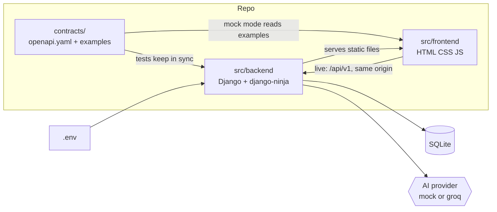

# Design

## Context

Greenfield repo: only `CLAUDE.md`, `README.md` and `docs/input/` exist. Two sessions will work in parallel: the backend session on this laptop, the frontend session on another laptop under another account. They cannot message each other; the GitHub repository and the user are the only channels. See proposal.md for motivation.

## Goals / Non-Goals

**Goals:**
- Backend and frontend work on separate branches without touching the same files.
- The contract is the only place where the two sides meet.
- A fresh clone runs with a few documented commands.

**Non-Goals:**
- Any business logic, real screens, the Groq adapter, deployment.

## Decisions

**Ownership of directories**

| Path | Owner | Others |
|---|---|---|
| `src/backend/`, `pyproject.toml`, `poetry.lock` | backend session | read only |
| `src/frontend/` | frontend session | read only |
| `contracts/openapi.yaml`, `contracts/examples/`, `CLAUDE.md` | main session | read only |
| `contracts/requests/` | frontend session adds files; main session reads and removes them | no edits to existing files |
| `openspec/changes/<own change>/`, `docs/worklog/<session>.md` | the session that owns the change | not touched |
| `docs/` (other files), `openspec/specs/` | main session | read only |

**Contract changes without a channel.** The frontend session writes `contracts/requests/<yyyymmdd>-<slug>.md` (what is needed, why, proposed shape) and keeps going with its own mock data, marked in the request. The main session applies the request to `openapi.yaml` and the examples on `main`, deletes the request file in the same commit, and the frontend session merges `main`. File names are unique, so two branches never edit the same file. Alternative: let the frontend edit `openapi.yaml` directly. Rejected, concurrent edits of one YAML file conflict.

**Worklog per session.** `docs/worklog/main.md`, `backend.md`, `frontend.md` replace the single `docs/worklog.md` from `CLAUDE.md`, so parallel branches never touch the same file.

**Frontend session start.** The brief is written so a session on a fresh clone can begin without questions: clone, check out the foundation branch, `poetry install`, install the OpenSpec CLI and the `frontend-design` plugin, serve the repo root, open `?mock=1`. It is pasted as the first prompt on the other laptop. Merging back: the frontend pushes its branch; the main session fetches and merges it (archive before merge, as in `CLAUDE.md`).

**Contract first, hand-written.** `contracts/openapi.yaml` is the source of truth. Alternative: generate it from django-ninja code. Rejected, because then the frontend would wait for backend code to know the shape. Drift is prevented by tests: the document is valid, examples validate against schemas, and every backend route under `/api/v1` is declared in the contract (implemented ⊆ declared). Dev dependencies `openapi-spec-validator` and `jsonschema`, pinned.

**One origin, session auth.** Django serves `src/frontend` through its static files. Session cookie + CSRF header, no CORS, no tokens. Alternative: token auth with a separate frontend host. Rejected as more setup and more attack surface for 14 hours of work.

**Frontend without build.** Plain ES modules, hash router, one HTML shell. CSS design tokens as custom properties, one stylesheet per area. Polish strings live in one file (`js/strings.pl.js`) and never inside logic. Alternative: a framework. Rejected by the user (HTML, CSS, JS only).

**Mock mode.** `?mock=1` (stored in `sessionStorage`; `?mock=0` clears it) switches the API client from the live adapter to a mock adapter that fetches `contracts/examples/<operation>.<status>.json`. Mutations return their example response; keeping in-memory state is up to the frontend session. A banner marks mock mode. Standalone use: `python -m http.server` from the repo root, then open `/src/frontend/index.html?mock=1`. Alternative: copy examples into `src/frontend`. Rejected, it would drift.

**API surface v0** (all under `/api/v1`; the contract states the allowed roles):

| Resource | Operations | Allowed roles |
|---|---|---|
| health | `GET /health` | anyone |
| auth | `POST /auth/register`, `POST /auth/login`, `POST /auth/logout`, `GET /me` | anyone / signed in |
| group | `POST /groups`, `GET /groups/current`, `POST /groups/current/close` | any signed in / members / woman |
| members, invitations | `GET /members`, `POST /invitations`, `GET /invitations/{token}`, `POST /invitations/{token}/accept`, `DELETE /members/{id}` | members / woman or partner (see spec) / invitee / invitee / woman |
| check-ins | `POST /check-ins`, `GET /check-ins` | woman only |
| observations | `GET /observations/questions`, `POST /observations` | partner, supporter |
| summary | `GET /summary` | members, content depends on role |
| tasks | `GET /tasks`, `POST /tasks`, `POST /tasks/{id}/claim`, `POST /tasks/{id}/complete` | members |
| self-care | `GET /self-care` | woman only |

Help path, crisis handling and the AI summary text are part of `summary` and later changes; their exact fields are added then.

**Roles per membership.** An account has no role. A membership links account and group with `woman`, `partner` or `supporter`. A group has status `pending` (partner created it, the woman has not accepted) or `active`.

**AI provider.** A small interface `generate(prompt) -> text, source` with a mock implementation. Chosen at startup from `AI_PROVIDER`. Alternative: add Groq now. Deferred to the AI change to keep this change small.

**Settings.** Read from `os.environ` through a tiny helper; no extra library. `.env` is loaded by Poetry-run scripts via the shell or by the helper from the repo root if present. Missing `DJANGO_SECRET_KEY` with `DJANGO_DEBUG` off stops startup.

**Database.** SQLite, `DATABASE_PATH` from the environment. Code stays database-agnostic. No models in this change.

## Risks / Trade-offs

- [Contract changes mid-way break one side] → one owner, request files instead of live edits, changes announced in the worklog, both sides merge `main` after each change.
- [Frontend waits for a contract answer] → it keeps working on marked mock data and the user can relay urgent items; requests are small because v0 already lists every resource.
- [Mock data hides a real mismatch] → the guard tests validate examples against schemas; a live check happens when the sides connect.
- [Frontend laptop has no OpenSpec or plugins] → the brief lists the install commands; the skills are committed under `.claude/`.
- [Hand-written contract is slower than generating it] → accepted, the contract is small at v0.
- [14 hours left] → this change stays tiny: skeleton, contract, one endpoint, one mock page.
