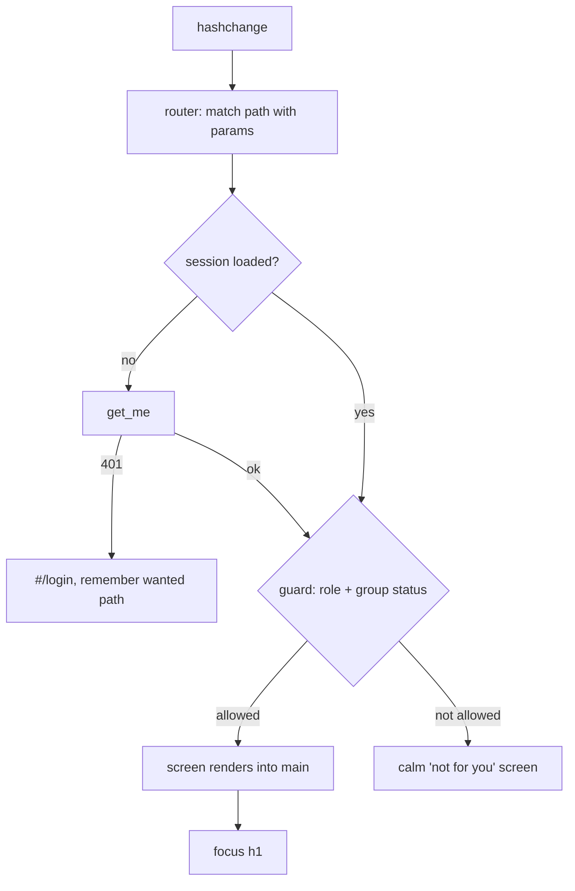
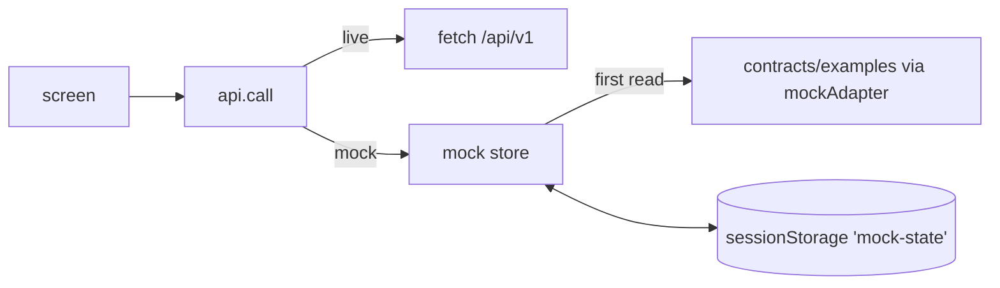
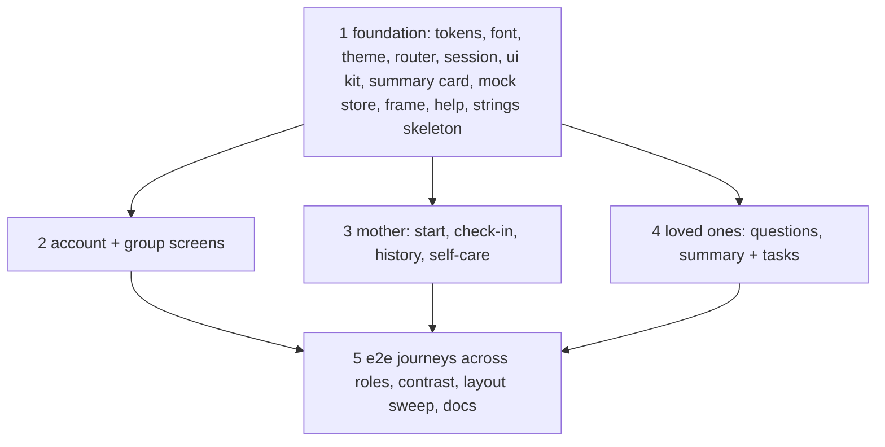

# Design

## Context

See proposal.md for why. What exists today in `src/frontend/`:

- `index.html` with a header, a notice slot and `<main id="screen">`.
- `js/api.js`: `createApi({ mock, variant, base })` with a live adapter (same origin, cookie,
  CSRF) and a mock adapter that reads `contracts/examples/<op>.<status>[.<variant>].json`.
- `js/operations.js`: operation table, compared with the contract by `tests/test_frontend_operations.py`.
- `js/app.js`: a hash router with exact paths only; `js/strings.pl.js`; `css/tokens.css`, `css/base.css`.
- `tests_e2e/` checks mock mode, live mode and layout against the placeholder home screen.

Constraints: no framework and no build step; Polish strings in one file; `contracts/`,
`src/backend/`, `tests/` and project config are read only for this branch; the backend is built
at the same time elsewhere, so mock mode is the main working mode.

## Goals / Non-Goals

**Goals:**
- One small set of building blocks (layout, cards, buttons, choice groups, forms, notices) that
  every screen uses, so parallel work stays consistent.
- A mock store that makes the demo behave like the real app, with no change to the live adapter.
- File ownership that lets screens be built in parallel without editing the same lines.

**Non-Goals:**
- Client-side caching or optimistic updates in live mode; each screen reloads what it shows.
- Animations beyond short, reduced-motion-aware transitions.

## Decisions

### 1. Visual system

Tokens on `:root`, dark values under `[data-theme="dark"]` and under
`@media (prefers-color-scheme: dark)` guarded by `:root:not([data-theme="light"])`.

| Token | Light | Dark | Use |
|---|---|---|---|
| `--color-bg` | `#FAF7F2` cream | `#1C2420` green graphite | page |
| `--color-surface` | `#FFFFFF` | `#24302A` | cards |
| `--color-surface-soft` | `#F1EEE6` | `#2C3A33` | quiet panels |
| `--color-ink` | `#24302A` | `#E9EFEA` | text |
| `--color-ink-soft` | `#56635B` | `#B5C2B9` | secondary text |
| `--color-primary` | `#3E5A47` | `#9CC2A6` | buttons, links, focus |
| `--color-primary-ink` | `#FFFFFF` | `#13201A` | text on primary |
| `--color-primary-soft` | `#DCE6DE` | `#2F4237` | selected choice, chips |
| `--color-sage` | `#7A9A82` | `#7A9A82` | decoration only, never text |
| `--color-accent` | `#F2B79C` peach | `#F2B79C` | the one main call to action per screen |
| `--color-accent-ink` | `#3A2318` | `#3A2318` | text on accent |
| `--color-line` | `#E3DED3` | `#3A4A41` | borders |
| `--color-error` | `#9E3B2E` | `#F0A496` | form errors only, never trends |

Values are a starting point; the contrast test (task group 5) decides. Shapes: radius 1rem on
cards, 999px on chips; touch targets at least 44 px; content width 40rem for text, a two-column
grid on the mother's start screen from 960 px.

Font: Nunito variable `woff2` (latin + latin-ext for Polish letters) in `src/frontend/fonts/`
with `OFL.txt`, `font-display: swap`, system fallback. Alternatives: system font only (generic
look, judged design is 40% of the score), Google Fonts CDN (external request, breaks offline
demo).

Icons: a small set of inline SVG symbols in one module (`js/icons.js`), `aria-hidden` with a text
label next to them. No icon font, no dependency.

### 2. Theme switch

`<html data-theme>` is set before first paint by a tiny inline script in `index.html` that reads
`localStorage` (wrapped in try/catch). No stored value means no attribute, so the media query
applies. The switch in the header toggles between light and dark and stores the choice.

### 3. Routing and app state

- Router matches patterns such as `/invite/:token`. Routes:

| Path | Screen | Who |
|---|---|---|
| `#/login`, `#/register` | account | signed out |
| `#/` | start (by role and group state) | signed in |
| `#/check-in` | check-in + history | mother, active group |
| `#/questions` | observations | partner, supporter, active group |
| `#/tasks` | tasks | any member, active group |
| `#/group` | members, invitations, close | any member |
| `#/invite/:token` | invitation preview + accept | anyone (accept needs a session) |
| `#/help` | help place | anyone |

- `js/session.js` holds the current person (`get_me` result). It is reloaded after sign in,
  sign out, creating a group, accepting an invitation and closing the group. Screens get
  `{ api, session, params, navigate }`.
- `#/` decides: no membership -> onboarding; `pending` -> waiting; mother -> her start; loved
  one -> their start. A closed group shows a short closed note on start and group screens.

Alternative: one route per role (`#/mother`, `#/partner`). Rejected: links in the navigation and
tests would depend on role for no gain.

### 4. Screens and components

Each screen is a module in `js/screens/` exporting `async (ctx) => Node`. Shared pieces live in
`js/ui/`: `layout.js` (page, card, section heading), `forms.js` (field with label and error,
choice group as radio cards inside `fieldset`/`legend`, submit with busy state), `feedback.js`
(loading, error with retry, empty state, inline status), `dialog.js` (native `<dialog>` for
confirmations). Screens never build raw colours or spacing; they use classes from
`css/components.css` and `css/screens.css`.

Navigation: `<nav aria-label>` in the header on wide screens and fixed to the bottom on phones,
built from the session; the current item has `aria-current="page"`.

Trend wording (no traffic lights): one sentence and one icon per value, all in calm colours.

| Trend | Icon | Tone |
|---|---|---|
| `stable` | leaf | calm sentence |
| `uncertain` | cloud | "we are watching gently" sentence |
| `needs_attention` | hand/heart | caring sentence + link to `#/help` |

### 5. Stateful mock

`js/mock-store.js` wraps the existing mock adapter. On first use it loads the examples it needs
(me per perspective, tasks, members, check-ins, questions, summary per audience, self-care) and
keeps them in one state object saved to `sessionStorage`. Mutations update that object and
return a response with the same shape as the contract example: a new check-in gets the next id
and `created_at = now`, `claim_task` sets `claimed_by` to the current person, `create_group`
sets the membership, `logout` marks the person signed out, `login` and `register` sign them in.
Rule checks the backend would make (only the claimer completes, only the mother removes, the
mother cannot remove herself, pending and closed groups refuse data) are mirrored with the
matching contract error examples, so error states can be shown in the demo.

The perspective switch in the mock notice sets the variant (`woman`, `partner`, `supporter`,
`no_group`, `pending`) and the store answers `get_me`, `get_summary` and `create_group` with the
matching variant. "Zacznij demo od nowa" clears `mock-state`. `?mock=0` also clears it.

Alternatives: keep stateless examples (demo feels broken: a taken task stays open); add a fake
server (a dependency and a second process for the demo).

### 6. Strings and parallel work

`strings.pl.js` keeps one exported object with one top-level key per area (`common`, `nav`,
`account`, `group`, `wellbeing`, `summary`, `observations`, `tasks`, `help`, `mock`). Group 1
creates all keys with the strings the frame needs; each later group edits only its own key.

Groups 2 to 4 run in parallel, each owning its screen files, its strings key and its own e2e
test file (`tests_e2e/test_<area>.py`). Only group 1 touches `app.js`, `ui/`, `css/tokens.css`
and `css/components.css`; later groups put screen styles in `css/screens/<area>.css`, linked from
`index.html` in group 1.

### 7. Tests

- Browser tests in `tests_e2e/`, mostly in mock mode on the static server (fast, no database),
  one per spec scenario where the scenario is visible in the UI. Live-mode tests stay limited to
  what the backend on this branch serves today.
- Contrast: an e2e test reads the computed colours of body text, secondary text and buttons in
  both themes and computes WCAG ratios in the page.
- Layout sweep: every route at 375 px has `scrollWidth <= clientWidth`.
- `tests/` is not ours; the existing operations test keeps passing because `operations.js` does
  not change.

## Risks / Trade-offs

- [Mock store drifts from the real backend] -> responses reuse the contract example shapes, and
  live mode never goes through the store.
- [Parallel agents collide] -> fixed file ownership per group (decision 6); the main session
  merges and runs the full suite after each group.
- [Peach accent fails contrast with white text] -> accent always carries dark ink; checked by the
  contrast test.
- [Backend answers differ from examples when both branches meet] -> screens show `error.message`
  from the server and never rely on example-only values.
- [Removing the placeholder home breaks existing shell tests] -> group 1 updates them to the new
  start screen in the same commit.

## Migration Plan

None. The frontend is static; merging the branch replaces the placeholder screen.

## Open Questions

None that change the plan. Assumptions to confirm are listed in proposal.md.
