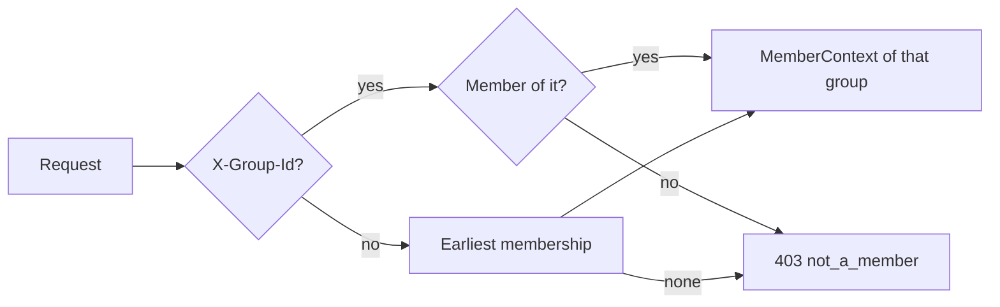
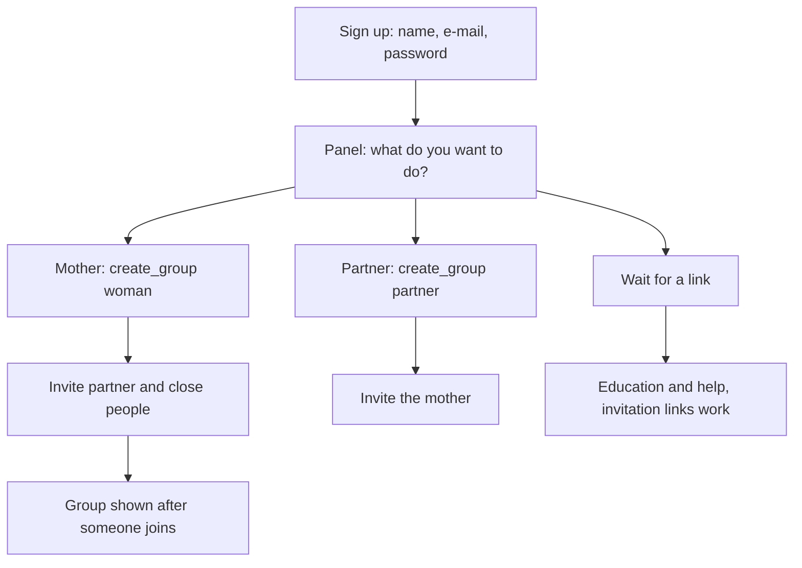

## Context

Today a person has one `Membership` (one-to-one with the user) and every group-bound call finds the group through it. The v0 contract is frozen: `get_me` has a single nullable `membership` and its schemas forbid extra fields. The frontend is vanilla JS with hash routes and a mock store that serves contract examples. Sign-up leads straight to a "start a group" choice, which is why two test accounts ended up in two groups.

## Goals / Non-Goals

**Goals:** accounts first and groups second; many groups per account with a clear role in each; one general place for everyone (education, help); a landing page; the first-run fixes.
**Non-goals:** path-scoped URLs, preferences, reminders, AI operations, changing any v0 shape.

## Decisions

### 1. Many memberships, two database rules
`Membership.user` changes from one-to-one to a foreign key. Constraints: unique `(user, group)`; unique `user` where `role = woman`; the existing one-woman-per-group rule stays. A partner's single pending group is checked in the service (a conditional rule that spans the group table is awkward in a constraint and is not a safety invariant). The migration is additive and reversible: the reverse step fails loudly if a user has more than one membership.

### 2. Group selection by header

`member_context` is the only place that resolves the group, so every router already uses it and gains the behaviour without edits. `get_me` reads the same header for its `membership`. Alternative: `/groups/{id}/...` paths. Rejected: it breaks the frozen contract and rewrites every route and test.

### 3. `list_memberships`
A new read-only operation returns `{items: [{group_id, role, group_status, woman_name}]}`. `me` is not extended because its schema is frozen. The frontend loads it after `get_me` and after every group change.

### 4. Frontend session
The session keeps `me`, the list of memberships and the selected `group_id` (remembered in `localStorage`, validated against the list). `api.js` adds `X-Group-Id` to every call that is not account-level (`get_me` included, so `me.membership` is the selected one). Navigation is built from two parts: general (start, education, help) and group (by role in the selected group). Switching a group re-renders the current route.

### 5. Panel after sign-up

The panel is a screen of the start route when `memberships` is empty, and a dialog from the switcher ("Dodaj grupę") otherwise. The mother card is hidden when she already is a mother.

### 6. Same place for everyone, group tools by role
Start without a group: the panel plus education and help cards. Start inside a group: the role start as built before, plus the education entry in the navigation. Education is static content in `strings.pl.js` plus one screen; it needs no API. Alternative: serve it from the backend. Rejected: no need to version it, and it works signed out of a group.

### 7. Landing page
`#/` for a signed-out visitor renders the landing page; `#/login` and `#/register` stay. Sections: hero with a one-line promise and two actions, the three roles, how it works in three steps, privacy promise, "not a doctor" note with the help link, closing call to action. Design follows the existing tokens and fonts, with a calm palette, large type, soft illustrations as inline SVG, scroll-reveal with `IntersectionObserver` and CSS transitions, all disabled under `prefers-reduced-motion`. Built with the `frontend-design` skill, then checked with screenshots at 375 and 1280 px in both themes.

### 8. Summary, help, tasks, account
`get_summary_extended` replaces `get_summary` on both starts; reasons and help render under the trend. `get_help` feeds the help place. Suggestions are a card on the tasks screen. Delete account and leave group get confirmation dialogs (`ui/dialog.js`).

### 9. Mock store
The mock store holds a list of memberships per demo person and honours the selected group, so the whole flow runs without a backend. New contract examples: `list_memberships.200.json` (+ variants `two_groups`, `empty`), `list_memberships.401.json`.

## Risks / Trade-offs

- A bug in group resolution would leak data between groups. Mitigation: tests with two groups where one person has different roles, asserting both data and permissions per group.
- The frozen-baseline guard may flag the header convention. Mitigation: it is described in conventions only, no operation changes; the guard test runs in the first backend group.
- Existing tests that assert the old "second group refused" rule change on purpose.
- Education texts are health content. Mitigation: plain, general wording, no diagnosis, flagged for expert review.
