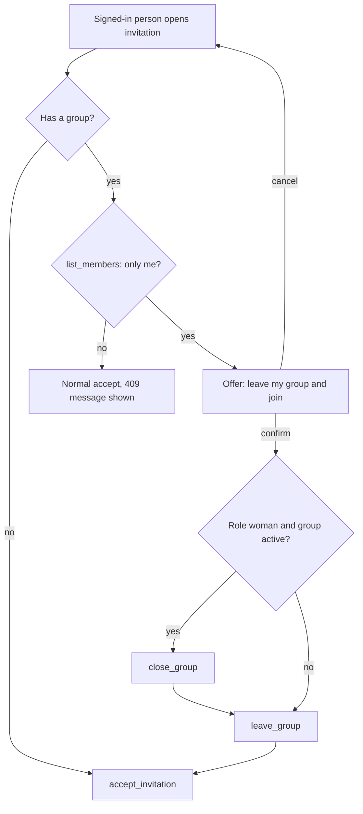

## Context

The merged frontend is vanilla JS with a mock store that mirrors the contract. The backend enforces one group per person. Opening an invitation while in a group answers 409 `already_in_group`. The onboarding makes it easy to start a group by reflex, so a mother and a partner who test the app together end up in two groups.

## Goals / Non-Goals

**Goals:** fix the five reported problems without a backend or contract change; adopt the operations that the fixes and basic expectations need.
**Non-goals:** the operations listed in the proposal; changing backend rules; a role choice at sign-up.

## Decisions

### 1. Hide the mock narrative in the frontend
`summaryCard` renders the narrative only when its source is not `mock`. The sample chip and its string go away. Alternative: have the backend return no narrative for the mock provider. Rejected: needs a contract change, and the contract example shows `mock` as a valid source.

### 2. One neutral `uncertain` sentence
The backend gives `uncertain` both for "mixed" and for "no data" and sends no flag. A sentence that is true for both avoids a contract change. Alternative: ask for a `has_data` field. Rejected for now; the statements below the sentence already say "za mało informacji".

### 3. Close person is an explanation, not an action
The backend forbids a supporter to create a group, so there is nothing to call. The card is shown as text in the same list, without a button, with the instruction to ask the mother for a link. The link screen already offers sign-up.

### 4. Leave and join from a lone group, on the client

The steps are not atomic. If `accept_invitation` fails after `leave_group`, the person has no group and sees the error; the invitation is still usable because it was not consumed, and the onboarding is shown. Alternative: a backend operation that does it atomically. Rejected here to keep the change frontend-only; it can be a contract request later.

### 5. Leave, issued invitations, delete account
Plain screens on top of the operations, each with a confirmation dialog where data is lost (`ui/dialog.js`). The invitation list reloads after create and revoke.

### 6. Help place
`get_help` replaces the placeholder. Signed out, the screen shows only 112 because the call needs a session. The static notice that the app is no doctor stays.

### 7. Mock store
Each adopted operation is added to the mock store using the contract examples, so mock mode and the e2e suite keep working without a backend.

## Risks / Trade-offs

- A mother loses her entries when she switches groups. Mitigation: explicit confirmation text (assumption 1).
- Non-atomic switch can leave a person without a group. Mitigation: the invitation stays valid; recovery is the normal onboarding.
- The `uncertain` sentence is vaguer than before. Accepted: it is honest.
