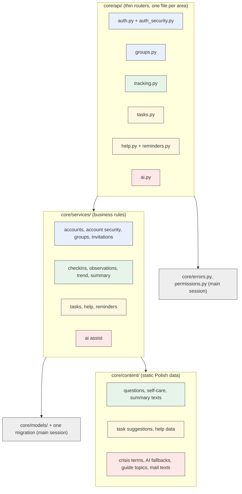
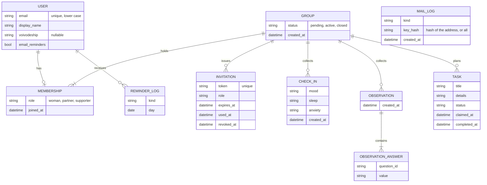
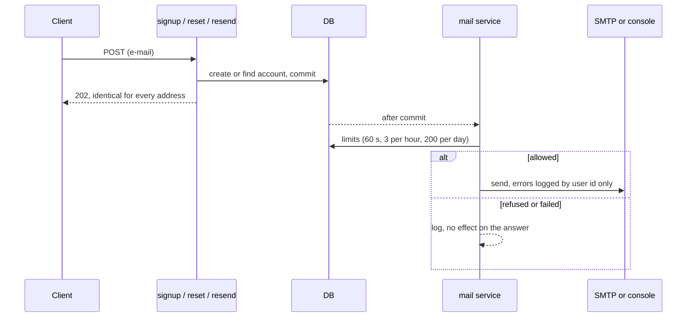
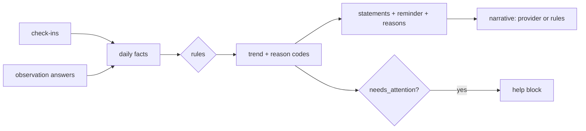
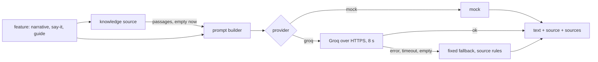

# Design

## Context

See proposal.md for why. Today only `health` runs. `contracts/openapi.yaml` (25 operations) and
`contracts/examples/` are the source of truth, and `tests/` already validates the contract. The
frontend session builds against the contract and reads examples in mock mode, so it must never see
an existing operation change. Django 6.1 with django-ninja 1.7, SQLite, no migration has ever run
(the local `db.sqlite3` has no tables), the AI provider interface is `generate(prompt) ->
Generation(text, source)`.

## Goals / Non-Goals

**Goals:** every operation works as the contract says; privacy rules hold in code and in the
database; existing operations stay frozen and provably so; several agents can build in parallel
without touching the same file; retrieval with sources can be added without changing any response.

**Non-Goals:** retrieval itself, background workers, a second contract file, any frontend change.

## Decisions

### 1. Additive contract with a frozen baseline

New paths, methods, schemas and examples are appended to `contracts/openapi.yaml`. Before the first
edit, a script writes `contracts/baseline/v0.json`: for each v0 operation, a SHA-256 of its canonical
JSON with every `$ref` resolved, plus the hash of each of its example files. A guard test recomputes
the hashes and fails with the operationId or file name that changed. New operations and files are
ignored by it. A new method on an old path (for example `DELETE /invitations/{token}`) is a new
operation, so it is allowed.

Alternatives: a diff tool such as `oasdiff` (new dependency, needs a binary); a second file
`openapi.v1.yaml` (splits the guard tests and the frontend's reading). Rejected for cost.

### 2. New operations

All under `/api/v1`, all with `x-roles`, examples and Polish error messages.

| operationId | Method and path | Roles | Purpose |
|---|---|---|---|
| `delete_account` | DELETE `/me` | signed_in | delete the person and what they wrote |
| `get_preferences` | GET `/me/preferences` | signed_in | voivodeship, e-mail reminder switch |
| `update_preferences` | PUT `/me/preferences` | signed_in | save them |
| `leave_group` | POST `/groups/current/leave` | partner, supporter | leave |
| `list_invitations` | GET `/invitations` | woman, partner | unused invitations |
| `revoke_invitation` | DELETE `/invitations/{token}` | woman, partner | revoke one |
| `signup` | POST `/auth/signup` | anyone | inactive account, activation link, always 202 |
| `activate_account` | POST `/auth/activate` | anyone | activate from the token |
| `resend_activation` | POST `/auth/resend-activation` | anyone | new link, identical answer always |
| `request_password_reset` | POST `/auth/password-reset` | anyone | reset link, identical answer always |
| `confirm_password_reset` | POST `/auth/password-reset/confirm` | anyone | new password from the token |
| `change_password` | POST `/auth/change-password` | signed_in | current and new password |
| `get_summary_extended` | GET `/summary/extended` | all roles | summary plus `reasons` and `help` |
| `get_help` | GET `/help?voivodeship=` | signed_in | crisis lines and care path |
| `list_task_suggestions` | GET `/tasks/suggestions` | all roles | ready-made tasks |
| `release_task` | POST `/tasks/{task_id}/release` | all roles | claimer hands a task back |
| `list_reminders` | GET `/reminders` | all roles | what is due today |
| `ai_say_it_for_me` | POST `/ai/say-it-for-me` | woman | suggested message |
| `ai_conversation_guide` | GET `/ai/conversation-guide?topic=` | partner, supporter | opening lines, things to avoid, questions |

AI responses share one envelope: `source` (`mock`, `groq` or `rules`) and `sources` (a list of
`{title, url}`, empty now). `help` is a block `{crisis_lines[], voivodeship, path[], regional_contact}`.

### 3. Module layout and ownership

The main session builds the grey part first (models, the single migration, errors, permissions,
router stubs registered in `core/api/__init__.py`, test helpers). Agents A to E then own disjoint
files (colours above) and never edit models, migrations, settings, the contract or each other's
files. If an agent needs a model change, it stops and reports it.

### 4. Data model

Database constraints (the application checks first, the database has the last word):

- membership: unique `user`; unique `group` where `role = 'woman'`;
- invitation: `used_at` and `revoked_at` not both set; token unique;
- observation answer: unique `(observation, question_id)`;
- task: `open` means no claimer and no completion time; `claimed` means a claimer and no completion
  time; `done` means both; status in the allowed set;
- reminder log: unique `(user, kind, day)`, which makes the e-mail command idempotent;
- mail log: indexed by `(kind, key_hash, created_at)`; it stores a hash of the address, never the address;
- check-in values and answer values are checked against their sets.

`Task.created_by` and `claimed_by` point at the user. Leaving, removal and account deletion go
through services that first reopen the person's claimed tasks and delete their observation
answers, then remove the membership.

Custom user model (e-mail as login, display name on it): no migration has run, so there is nothing
to swap. Check-ins and observations point at the membership of their author.

### 5. Concurrency and idempotency

- Claim: `UPDATE task SET status='claimed', claimed_by=?, claimed_at=? WHERE id=? AND group=? AND status='open'`;
  one affected row means success. Complete and release use the same shape with `claimed_by = caller`.
- Accept invitation, in one transaction: conditional `UPDATE invitation SET used_at=now WHERE token=? AND used_at IS NULL AND revoked_at IS NULL AND expires_at > now`;
  zero rows means `invitation_not_found`. Creating the membership may hit a unique constraint; that
  is mapped to `already_in_group` or `role_taken` and the transaction rolls back, so the invitation
  stays unused. A closed group is checked first.
- Create group: the unique constraint on membership decides a race; the loser gets `already_in_group`.
- Reminder e-mails: insert the log row first; a unique violation means someone sent it already.
- Race tests run two threads on a file database with `transaction=True`. SQLite serialises writers,
  which is enough because every decision is a single conditional statement.

### 6. Errors, auth and permissions

`core/errors.py` defines `ApiError(status, code, message, fields)` and ninja exception handlers
that produce `{"error": {...}}` for validation errors (422 with `fields`), 401, 403, 404, 405,
malformed JSON and unexpected errors (500, no detail). A custom session-auth class with CSRF
enabled returns 401 `unauthorized`. `core/permissions.py` has one function, `member_context(request,
roles, active=False)`, that returns the user, membership and group, and raises `not_a_member`,
`forbidden`, `group_pending` or `group_closed`. Routers call it first; they hold no other rules.

### 6a. Mail and account security

- Tokens are signed by Django (`TimestampSigner` for activation, the password reset token
  generator for reset), carry the user id and the state that must change on use (`is_active`, the
  password hash), so they work once and need no table. Activation lives 3 days, reset 1 hour.
- `core/mail.py` is the only place that sends mail: `send(kind, user, subject, body)` returns a bool
  and never raises. Signup, resend, reset, invitations by e-mail and reminders all use it, so the
  limits and the error handling exist once.
- Settings read `EMAIL_MODE` (`console` default, `smtp`), `EMAIL_HOST` (default `smtp.gmail.com`),
  `EMAIL_PORT` (587, TLS), `EMAIL_USER`, `EMAIL_PASS`, `EMAIL_FROM`, `APP_BASE_URL`,
  `ALLOW_LEGACY_REGISTER`. `EMAIL_PASS` is a Google app password. Tests run with the in-memory
  backend and never open a connection.
- Identical answers: the route never branches its response on the account or on the limit; only the
  work done after the commit differs.
- A person known only by an inactive account that signs up again gets a new activation link
  (counts against the limits); an active account that signs up again gets a short "you already
  have an account" mail with a reset link.

### 7. Trend engine

A pure function takes daily facts for the last 7 Warsaw days and returns the trend and a set of
reason codes; a thin service loads the facts from the database. The rules are in the
trend-and-summary spec. Statements, reasons and care reminders are fixed Polish sentences chosen by
trend and reason codes, listed in one content module, so an allowlist test can read them all.

Privacy in code: the facts keep only per-day booleans, never an author id. The narrative prompt gets
the trend label and the statement ids only. Nothing in a response counts observers. With one
observer, a reason sentence still cannot be linked to a person because it never says which source
fired.

Closed group: loved ones get `uncertain`, a "group is closed" statement and no reminder; the woman
keeps her own summary. Pending: `uncertain` with a "not enough yet" statement.

### 8. AI seam

- `ProviderError` is the only failure a provider raises; `assist.generate(feature, prompt, fallback)`
  turns it into the fallback, so no route handles provider errors.
- Groq uses `urllib` and the chat completions endpoint, key from `GROQ_API_KEY`, model from
  `GROQ_MODEL`. Error text is built without the request headers, so the key cannot leak.
- The crisis check for "say it for me" is a list of Polish phrases and stems, compared with the text
  lowercased and with diacritics folded. It runs before the provider and is not AI.
- Knowledge source: `retrieve(query) -> list[Passage(title, url, text)]` with a `NullKnowledge`
  default chosen by `KNOWLEDGE_SOURCE=none`. Prompts include the passages and responses list them
  in `sources`. A retrieval change later adds one class and one setting value.
- Tests never call Groq: the HTTP function is injected and replaced by a fake.

### 9. Time

"Today" and "last 7 days" use Europe/Warsaw calendar days; stored times stay UTC. One helper turns a
UTC time into a Warsaw date, and every rule uses it. A test fixes the clock around midnight.

### 10. Tests that protect what works

- `tests/helpers`: `call(client, operation_id, ...)` fills the URL, sends CSRF, then checks that the
  status is declared and the body validates against the contract schema. All API tests use it, so
  every test is also a contract test and records the (operation, status) pairs it saw.
- Spec scenarios map one to one to tests in `tests/api/test_<area>.py`.
- `tests/regression/`: v0-only journeys (core journey, partner-first journey). They never use a new
  operation and are never edited when features are added.
- Baseline guard (decision 1) and the existing contract guards keep running.
- Coverage test at the end of a full run: every operation was exercised with its success status.
- Mutation checks in a throwaway copy for the important rules: privacy, atomic claim, role checks,
  baseline guard, crisis check.
- One browser journey in live mode against the seeded database.

### 11. Delegation

Five agents in parallel after the main session lands contract, models and foundation:

| Agent | Owns (create or edit) | Reads only |
|---|---|---|
| A groups | `api/groups.py`, `services/groups.py`, `services/invitations.py`, `tests/api/test_groups.py`, `test_invitations.py`, `test_accounts_lifecycle.py` | everything else |
| B tracking | `api/tracking.py`, `services/{checkins,observations,trend,summary}.py`, `content/{questions,self_care,summary_texts}.py`, `ai/narrative.py`, tests | |
| C tasks and help | `api/tasks.py`, `api/help.py`, `api/reminders.py`, `services/{tasks,help,reminders}.py`, `content/{task_suggestions,help_data}.py`, `management/commands/send_reminders.py`, tests | |
| E account security | `api/auth_security.py`, `services/account_security.py`, `content/mail_texts.py`, `tests/api/test_account_security.py` | everything else |
| D AI | `ai/{groq,assist,knowledge}.py`, `api/ai.py`, `content/{crisis_terms,ai_fallbacks,guide_topics}.py`, tests | |

Agents never commit, never change branches, never touch the database file, and report what they
built and what they could not. The main session runs lint, format and the whole suite, then commits
one group at a time.

## Risks / Trade-offs

- Help data may be wrong or stale → every entry has a source link and the owner verifies before the
  demo (listed as an assumption in the proposal).
- One observer makes any trend change guessable by the woman → statements never name a source and
  `reasons` stay at the level of "signals from daily life"; accepted limit of a closed group of
  two or three people.
- Gmail limits or blocks the mailbox, or the app password is wrong → the global limit protects the
  daily quota, failures never break a request and are logged by user id, `console` is the default,
  and a user can always ask for a new link.
- The activation and reset links need two new frontend screens → a message in
  `docs/from-be-to-fe/` and the contract examples tell the frontend session; until it exists the
  links can be tested through the API.
- Groq model name or key unavailable → default is `mock`, failures fall back, `.env.example`
  documents the variables; the default model name is an assumption to confirm.
- Thread race tests on SQLite can flake → they assert the outcome (one winner), use a file database
  and retry-free conditional statements; a failure is a real defect.
- Large change in one night → groups are small, parallel and each verified; a failed group is cut
  back to what passes review, and the cut is reported, not hidden.
- The frozen baseline hides a needed fix to an old operation → the rule is deliberate; the fix is a
  new operation and the frontend moves to it.

## Migration Plan

One initial migration for the whole schema, reversible. `db.sqlite3` is empty and git-ignored; the
file is copied to `db.sqlite3.bak` before the first migrate. Tests and probes use `DATABASE_PATH`
pointing at a temporary file. Rollback: revert the commits and delete the database file.
